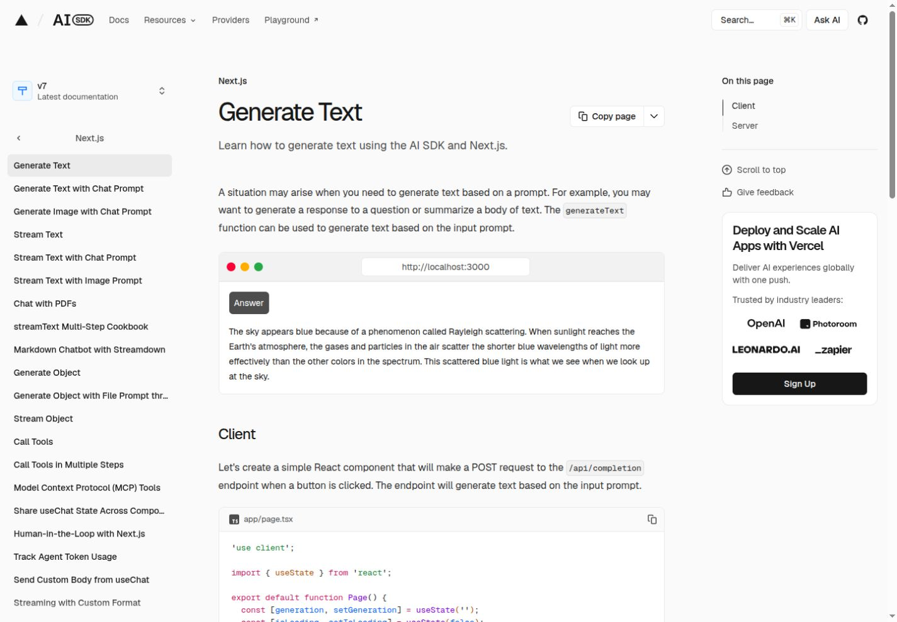

# AI SDK docs migration: three production publication workflows

Upstream is the original AI SDK documentation application, pinned to `3ebefff610f96892c50be48cf1838c453e2349f7`, using Next.js and Geistdocs. **Nift `ai-sdk`** is the authored-source migration. **Nift `ai-sdk-agent`** is the rendered-source migration. These names identify different maintained source models, not different versions of the AI SDK itself.

```
Nift ai-sdk:
authored Markdown/MDX/frontmatter + structured inputs
  → local pinned version synchronization
  → bounded MDX/component renderer + derived reference projections
  → transient HTML and shared UI
  → Nift raw composition
  → complete publication, search and runtime assets

Nift ai-sdk-agent:
maintained HTML + metadata/navigation + coordinated reference projections
  → bounded island SSR refresh and shared UI
  → Nift raw composition
  → complete publication, search and runtime assets
```

Neither pipeline changes Nift core or migration templates. The authored timings measure the complete compatibility pipeline, not native Nift `@markup` performance. The rendered-source project has no routine Markdown/MDX renderer. It also carries a greater coordination burden: a content edit can require maintained HTML, search data, Markdown download and LLM reference updates. This distinction is intentional.

## Publication and parity

Both publish 1,674 HTML routes: 1,386 primary documents, 259 recipe aliases and 29 ancillary/home pages. The three versions preserve nine document/provider/cookbook families and 506 redirect patterns. All 1,386 Markdown endpoints match frozen bytes; seven discovery outputs, metadata, sitemap/robots, version switching, search and OG fixtures are separately checked. Primary content, headings/anchors, code, local links, aliases and ancillary pages pass the frozen comparisons.

Each optimized migration passes 72 browser states: 12 representative paths, desktop/mobile and light/dark/system. System resolved light in this environment. The frozen upstream and both migration observations total 216 states in the accepted initial campaign; optimization repeats 144 migration states against the same frozen upstream observations. Comparison covers visible content, headings, navigation, TOC, title, geometry, colors and broken images. It does not claim animation-pixel or generated React-ID equality.

Pinned React components hydrate as independent islands around opaque static content. Generation/loading, object generation, nested weather, prompts, playback/media, provider/model selection, recipes, tabs/copy, version switching, mobile navigation, search and local chat/feedback fixtures were exercised. Local deterministic transports establish UI/transport behavior; they do not certify live AI, feedback or analytics services. No real submissions or private credentials were used. Fonts and the stylesheet are maintained publication assets; stylesheet changes need an explicit asset-maintenance workflow rather than an implicit upstream Tailwind build. Homepage community statistics and the browser model catalog are pinned maintained snapshots in the migrations; upstream retains its public npm/GitHub statistic requests and timeout fallbacks. Those inputs require explicit updates and are not claimed to refresh during normal Nift publication. The external playground remains separately hosted.

The asset/link/CSS audit preserves 21 inherited broken links and finds zero new failures. Upstream Next sometimes streams a soft 404 status on the first uncached request; the migration consistently returns 404. Preview robots retain `Disallow: /`; production indexing policy requires deployment configuration. Query/slug OG images remain request-driven runtime output, with maintained fonts/background and explicit metadata; normal publication does not regenerate a corpus of cards.

## What profiling changed

The initial faithful A7 implementation is preserved, along with single diagnostic observations and a rejected cache attempt. Initial sequential phases summed **140.712 s authored** and **91.409 s rendered**. MDX compatibility/SSR was 89.101 s and Markdown projection conversion 24.902 s in the authored path. Whole-DOM island refresh was 62.036 s in the rendered path. These are initial diagnostic builds, not five-sample benchmark medians.

Caching every unique Shiki HAST/compiled file was rejected: MDX rose to 108.15 s and maximum individual process/phase RSS to about 2.49 GiB. The retained implementation uses four bounded workers, content-addressed compiled bodies, retention only until a reused body's last use and a bounded repeated-input Shiki cache. Of 1,386 documents, 201 compilations are reused within a forced build. Metadata, compiler/body and renderer dependencies are distinct.

Rendered-source refresh now locates island spans lexically and batches SSR rather than reparsing every large document into a DOM. An independent real-corpus DOM check verifies 983 mounts in 1,415 document/ancillary sources, including adjacent JSON and exact host boundaries. Replacements affect only host interiors. The surrounding maintained HTML remains opaque.

Actual esbuild input graphs govern client/SSR/runtime caches, including plugin-loaded inputs and output SHA/existence checks. Unrelated content edits preserve island bundles. Search caches are version-scoped, authored Markdown projections are source-scoped and discovery depends on the relevant projection bytes. Compact version props pass all 5,022 path/version mappings against the original complete-inventory resolver. Deployment redirects are owned runtime snapshots; renamed/deleted manifest-owned HTML and Markdown retire together.

Agent composition no longer depends on global content/navigation models when the actual dependency is a page's materialized fragments. One/ten-page edits compose one/ten HTML files. After the scoped dependency change and fixture restoration, all 3,219 public/runtime files were byte-identical. Shared layout/navigation changes retain their legitimate fan-out.

The accepted optimized single engineering diagnostics were **53.642 s authored** and **25.673 s rendered**. Those runs establish the profiling trajectory, not the final headline timing; the serialized five-sample campaign below has its own medians and ranges. Different diagnostic and campaign observations are not interchangeable optimization percentages.

| Sequential diagnostic phase | Initial authored s | Optimized authored s | Initial rendered s | Optimized rendered s |
|---|---:|---:|---:|---:|
| Content compatibility / island refresh | 89.101 | 27.38 | 62.036 | 3.77 |
| Derived Markdown downloads | 24.902 | 7.55 | maintained | maintained |
| Shared shells | 12.743 | 7.40 | 16.772 | 11.18 |
| Search | 6.393 | 4.64 | 6.251 | 4.93 |
| Composition preparation plus Nift | 2.533 | 1.69 | 2.927 | 2.36 |

This is a selected diagnostic breakdown; omitted phases remain in the raw profiling records. Internal Shiki/worker counters are nested and are not added here.

## Measurement boundaries

The measured upstream command is `pnpm --dir apps/docs build:site`: version synchronization, Fumadocs source/index module generation and Next production build. The Fumadocs CLI stage does not represent all Markdown/MDX work: actual compilation and highlighting also occur inside the Next build. It retains the pinned eight-CPU Next setting and frozen external image inputs. Nift measurements invoke `python3 scripts/build-content.py`, including preparation, bundling, Nift, Markdown/LLM projections, search and asset/runtime publication. Bare Nift composition alone is not the publication benchmark.

Each full/fresh/unchanged mode has five serialized samples per project, with project order rotated between replicates. Fresh application state clears generated application caches and owned products while keeping maintained assets, source/history, installed packages and OS caches. It is not a machine-cold test. State-reset/archive setup is outside the timed command; changed-input mutation, baseline cache copies and verification are also outside publication elapsed time. Upstream's unchanged command still performs production publication; it is not a development-server/HMR measurement. Deployment transfer, host/process startup and production backend latency are outside this build scope.

Sequential wall-time phases partition each pipeline. Shiki counters nest within MDX transforms; concurrent worker task sums can exceed elapsed wall time. Do not add those counters together. Component medians need not sum to the whole-pipeline median. The initial uninstrumented `io_hash_ms: 0` is not evidence of zero I/O; residual time includes startup, hashing, bundling and artifact work.

GNU maximum RSS is the maximum measured individual process/phase, not total concurrent memory. A supplemental 50 ms sampler sums live descendant RSS; shared pages may be counted more than once and short peaks may be missed. Both scopes remain visible. Next `.next`/public artifact counts and standalone public/runtime counts include different transport artifacts and are not presented as equal file counts.

## Final five-sample production measurements

| Workflow | Warm full s (range) | Fresh application s (range) | Unchanged command s (range) |
|---|---:|---:|---:|
| Upstream Next.js/Geistdocs | 337.34 (282.84–389.32) | 306.03 (287.49–340.79) | 264.93 (257.26–304.79) |
| Nift `ai-sdk` — authored | 83.16 (71.05–96.46) | 68.87 (67.46–89.47) | 12.87 (11.89–18.65) |
| Nift `ai-sdk-agent` — rendered | 37.96 (26.95–41.87) | 28.09 (26.71–35.85) | 8.43 (6.28–11.56) |

Median seconds; ranges are all five observations. Fresh-state medians are lower here than warm-full medians, with overlapping ranges; the measurements do not establish a causal cold-state speed advantage. The repeated upstream unchanged command remains a production build, not a no-op or development server.

### Memory scope

| Workflow and mode | Median max individual process/phase MiB (range) | Median sampled tree RSS sum MiB (range) |
|---|---:|---:|
| Upstream Next.js/Geistdocs: warm-full | 23671.5 (19978.9–28277.9) | 29277.7 (27016.7–33514.6) |
| Upstream Next.js/Geistdocs: fresh-application-state | 16317.4 (16260.9–17300.4) | 25299.0 (24041.0–25600.6) |
| Upstream Next.js/Geistdocs: unchanged-cached | 19935.4 (19704.2–20583.9) | 29139.2 (29014.6–29717.4) |
| Nift `ai-sdk` — authored: warm-full | 901.8 (887.4–944.4) | 4380.7 (4372.5–4518.0) |
| Nift `ai-sdk` — authored: fresh-application-state | 909.4 (887.5–937.0) | 4222.8 (4163.6–4433.7) |
| Nift `ai-sdk` — authored: unchanged-cached | 517.4 (514.7–564.3) | 1259.5 (1197.2–1310.8) |
| Nift `ai-sdk-agent` — rendered: warm-full | 758.9 (757.4–759.4) | 777.4 (775.4–777.9) |
| Nift `ai-sdk-agent` — rendered: fresh-application-state | 753.6 (693.3–785.3) | 754.8 (687.5–792.6) |
| Nift `ai-sdk-agent` — rendered: unchanged-cached | 283.0 (282.2–284.4) | 289.5 (260.1–294.2) |

The tree sum is a nominal 50 ms sampler with scan overhead; shared pages can be counted more than once and short peaks missed. It is not exact aggregate resident memory or an OS peak. Individual RSS alone understates the authored worker-pool footprint.

### Sequential component costs

Each cell is a five-sample phase median in seconds. Phase medians need not sum to the complete-pipeline median. Internal worker/plugin counters are separate diagnostic evidence.

#### Upstream Next.js/Geistdocs

| Phase | Warm full | Fresh application | Unchanged |
|---|---:|---:|---:|
| content-version-synchronization | 0.771 | 0.680 | 0.681 |
| fumadocs-mdx-generation | 0.389 | 0.331 | 0.314 |
| next-production-build | 334.457 | 303.585 | 262.689 |
| Whole minus observed CLI stage wall times (startup/shell residual) | 1.828 | 1.887 | 1.571 |

#### Nift `ai-sdk` — authored

| Phase | Warm full | Fresh application | Unchanged |
|---|---:|---:|---:|
| authored source synchronization | 1.200 | 1.279 | 0.937 |
| content island compilation | 1.229 | 0.904 | 0.205 |
| shared UI compilation | 1.190 | 0.977 | 0.164 |
| MDX compatibility and server rendering | 44.172 | 37.488 | 3.518 |
| content navigation | 0.654 | 0.421 | 0.407 |
| ancillary authored pages | 1.128 | 0.853 | 0.821 |
| Markdown projection conversion | 10.952 | 9.323 | 0.910 |
| discovery projections | 0.814 | 0.773 | 0.477 |
| shared page UI preparation | 12.411 | 10.964 | 3.476 |
| Nift composition | 3.172 | 2.290 | 0.835 |
| search indexing | 6.319 | 5.366 | 0.470 |
| runtime handler compilation | 0.315 | 0.221 | 0.075 |
| reference and runtime publication | 1.021 | 0.851 | 0.689 |
| ↳ composition preparation (nested) | 1.626 | 0.752 | 0.548 |
| ↳ Nift CLI composition (nested) | 1.616 | 1.473 | 0.228 |

#### Nift `ai-sdk-agent` — rendered

| Phase | Warm full | Fresh application | Unchanged |
|---|---:|---:|---:|
| content island compilation | 1.305 | 0.882 | 0.191 |
| shared UI compilation | 1.236 | 0.881 | 0.143 |
| maintained HTML island preparation | 5.144 | 4.679 | 0.962 |
| ancillary HTML island preparation | 0.335 | 0.337 | 0.049 |
| shared page UI preparation | 16.449 | 12.284 | 4.169 |
| Nift composition | 3.393 | 2.552 | 1.582 |
| search indexing | 6.715 | 5.443 | 0.393 |
| runtime handler compilation | 0.320 | 0.207 | 0.101 |
| reference and runtime publication | 1.124 | 0.930 | 0.824 |
| ↳ composition preparation (nested) | 1.400 | 0.831 | 1.197 |
| ↳ Nift CLI composition (nested) | 1.720 | 1.531 | 0.271 |

### Output accounting

| Workflow | Measured artifact directories | Files | Bytes |
|---|---|---:|---:|
| Upstream Next.js/Geistdocs | apps/docs/.next, apps/docs/public | 17964 | 5852913560 |
| Nift `ai-sdk` — authored | public, runtime | 3219 | 546621709 |
| Nift `ai-sdk-agent` — rendered | public, runtime | 3219 | 547792782 |

This table shows artifact accounting from the first warm sample; all raw samples retain their own output counts. Upstream build/runtime and standalone publication/runtime inventories have different transport artifacts; file-count equality is not claimed. Public HTML/Markdown/HTTP coverage is established by the separate parity gates.


## Controlled changed-input publication

| Input case | Upstream production s | Authored Nift incremental s | Rendered Nift coordinated incremental s |
|---|---:|---:|---:|
| body-1 | 267.89 | 13.19 | 7.83 |
| body-10 | 299.09 | 14.61 | 7.94 |
| body-100 | 317.16 | 20.95 | 8.28 |
| metadata-update-remove | 321.72 | 15.56 | 10.50 |
| shared-layout | 326.63 | 20.18 | 15.15 |
| navigation-order | 333.14 | 15.99 | 9.84 |
| historical-version | 304.79 | 14.24 | 7.48 |
| provider-reference | 266.53 | 16.34 | 8.68 |
| redirect | 271.14 | 12.23 | 5.90 |
| island-source | 259.37 | 19.31 | 11.77 |
| route-add | 256.71 | 21.32 | 11.92 |
| route-rename | 231.23 | 24.36 | 11.06 |
| route-delete | 248.95 | 21.71 | 10.63 |

These are single controlled production-publication observations, not five-sample medians or development/HMR measurements. All Nift incremental outputs equal forced recomputation, with maintained inputs restored; the paired forced timings and file-change counts remain in lifecycle evidence. Rendered-source body edits coordinate HTML, search metadata, Markdown downloads and LLM references. Its metadata case also coordinates navigation/sitemap; historical/provider comparisons use the coordinated cases rather than faster HTML-only isolation probes. Source editing/coordination labor is outside these elapsed times.

Upstream runs in an isolated pinned checkout with the same eight-worker production configuration and frozen images. Each case starts from its own prepared warm application cache; rename/delete begin with the prior fixture route already published. Historical v5 edits modify an isolated cached source fixture under the pinned SHA; this does not measure acquisition of a new upstream release. Route add/rename/delete assert both HTML and Markdown endpoint inventories. The maintained upstream checkout is untouched.

The upstream command remains a complete production rebuild. These observations establish publication behavior and timing, not that Nift beats the upstream development editing loop. A separate development/HMR and deployment/backend evaluation is necessary for an official migration decision.


## Remaining costs and engineering judgement

Authored MDX parsing/highlighting and derived Markdown/reference outputs remain real costs. Shared shell SSR, corpus metadata/hash scans, per-version search export and publication copying still impose fixed work. Navigation legitimately touches its tree's shells. The content islands remain one eager registry: seven outputs, 1,131,411 bytes across 16 island families. Shared chrome outputs total approximately 2,035,693 bytes. These are emitted bytes, not a claim that every page downloads every output. Registry splitting, dependency duplication, startup/scan costs, search granularity and concurrent-memory reductions are future profiling targets.

The migration binds four pinned internal Geistdocs UI modules and one pinned Fumadocs search reader. That is a maintenance liability, despite avoiding a Next application runtime. Upstream retains native framework/deployment integration and development tooling. Production AI/feedback credentials and a real deployment integration were not validated; a production adoption decision needs that work.

For **agents implementing under human direction**, I prefer **Nift `ai-sdk` (authored-source)** among the three implementations: it preserves one authoritative Markdown/MDX/frontmatter corpus and offers a controlled production pipeline with independently owned islands and lower measured publication time/memory. The rendered-source alternative asks the agent to coordinate several maintained projections. Upstream also retains authoritative content, with stronger native framework/development integration; I accept the bounded adapter maintenance cost for the demonstrated Nift publication model, while requiring a deployment/backend pilot before official adoption. For **humans and agents both editing**, I also prefer **Nift `ai-sdk` (authored-source)**. The faster rendered-source forced build is useful, but it does not by itself outweigh this source-of-truth advantage. Upstream is a credible choice when its native development/deployment integration is the priority; these build measurements do not measure that tradeoff completely.

Removing migration effort and incumbency does not change my preference for the Nift authored-source model in either maintenance scenario. The evidence justifies Vercel evaluating a migration **from the Next.js/Geistdocs application to Nift composition with independently retained islands**, including a real deployment/backend pilot. It does not establish an unconditional recommendation to migrate the official site.

The dedicated migration-init review preserves the actual generated guidance and proposes exact wording/scaffolding. It already permits React/Vue/Svelte and other tools; the weakness is island-composition discoverability and explicit build-product/dependency ownership, not a framework prohibition. No Nift guidance/core change is included in this experiment.

## Evidence and reproduction

See [final raw measurements and hashes](benchmark-evidence/SHA256SUMS.json), [sample records](benchmark-evidence/final-benchmark/samples.json), [reproduction runners](benchmark-tools/README.md), [nested profiling diagnostics](microprofiles/README.md), [initial profiling](A8-INITIAL-PROFILING.md), [optimized parity](A9-PROFILING.md), [browser matrix](A9-BROWSER-MATRIX.json), [interactions](A9-INTERACTIONS.json), [fresh public clone](A9-FRESH-CLONE-PROOF.json), and [migration-init assessment with exact proposals](MIGRATION-INIT-REVIEW.md).



Accepted A10 closes the experiment. Remaining costs are candidates for later tooling or Nift planning, not permission to reopen this migration or change Nift core. No Labs publication is included in this checkpoint.
